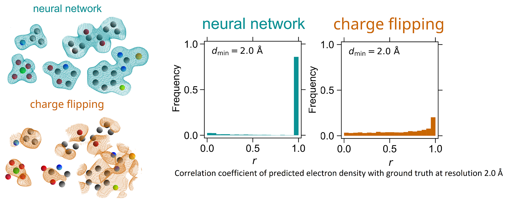

### Training code for the PhAI neural network
The PhAI neural networks is trained on molecular crystal data to solve the crystallographic phase problem and achieves breakthrough performance on low resolution data https://www.science.org/doi/10.1126/science.adn2777 

The training dataset and trained network parameters can be found at: https://doi.org/10.17894/ucph.681ff154-a66a-41f4-aee6-9168777de7d9
                                                           

